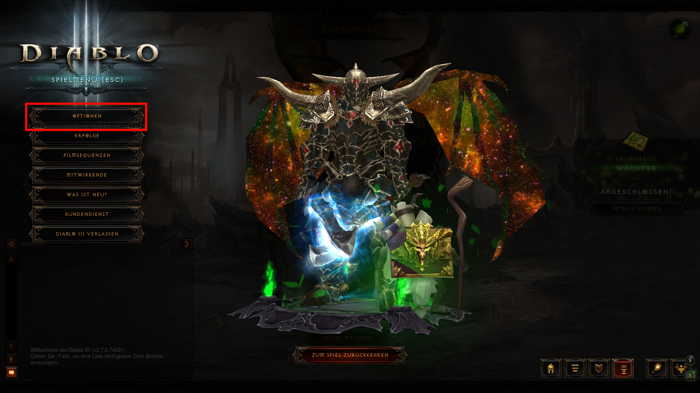
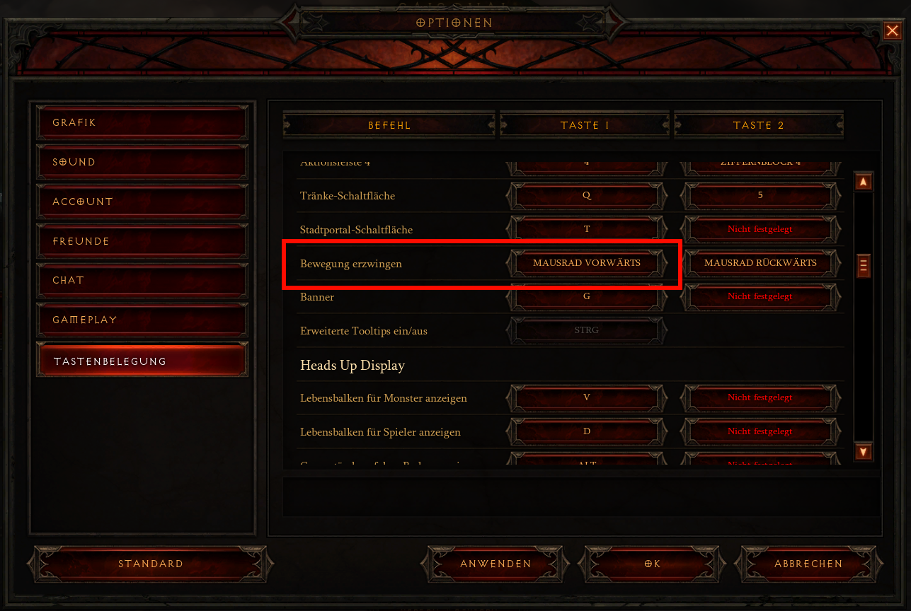

# Einstellungsanleitung für Diablo3:

1. [Diablo 3](README.md#Diablo-3): kurze Spielebeschreibung
1. [Programme](README.md#Programme): alle verwendeten Programme
1. [Hardware](README.md#Hardware): verwendete Hardware
1. [FLipMouse Einstellungen](README.md#FLipMouse-Einstellungen)
1. [JoyToKey Einstellungen](README.md#JoyToKey-Einstellungen)
1. [Diablo 3 Einstellungen](README.md#Diablo-3-Einstellungen)

## Diablo 3

Das Spielprinzip von Diablo 3 ist simpel: „Hau so lange auf einen
Gegner, bis er stirbt und Gegenstände fallen lässt". Begleitet wird
dieses Konzept von einer interessanten Story und vielen kleinen
Nebenquests. Selbst nach der Story kann man Stunden lang weiterspielen
und nach besserer Ausrüstung suchen, um in die Bestenliste zu gelangen
in zeitlich begrenzten Portalen.

In Diablo 3 gibt es sieben verschiedene Klassen, mit denen das Spiel
gespielt werden kann. Jede Klasse hat ihre eigenen Fähigkeiten und
eigene Ausrüstungssets. Bis Stufe 70 werden neue Fähigkeiten
freigeschaltet und man kann außerhalb eines Kampfes zwischen diesen
wechseln. Nach dem die maximal Stufe für einen Charakter erreicht worden
ist, beginnen Paragon Level welche übergreifend für alle Charaktere
gelten und kleine Verbesserungen gewähren.

Anmerkung: Die vorgestellte Konfiguration ist für Nahkampfklassen
ausgelegt wie den Barbaren, den Mönch und den Kreuzritter.

## Programme

Die verwendeten Programme beschränken sich auf die FLipMouse Software
und JoyToKey.

Die Konfigurationsdateien, sowie ein Cheatsheet befinden sich
[[hier]{.ul}](http://google.com).

Der Grund für die Verwendung von JoyToKey ist, dass Diablo 3
standardmäßig auf dem PC keine Controllerunterstützung anbietet. Da die
FLipMouse aber keine Funktion hat, in der Maus Funktion den Mauszeiger
in die Mitte zurückspringen zu lassen wird die FLipMouse als Joystick
verwendet und in JoyToKey werden die Aktionen ausgeführt.

## Hardware

Verwendet wurden die FLipMouse, ein passendes Stativ und zwei externe
Button, welche an die FLipMouse angeschlossen wurden.

## FLipMouse Einstellungen

Die vorgenommenen Einstellungen in der FLipMouse sind wie folgt
ausgewählt worden.

**Stick Actions (Mundstück Bewegung)** Joystick Movement

**Sip/Puff Actions (Mundstück Aktionen)**

-   Sip Function Click Right Mouse Button

-   Strong Sip Toggle Right Mouse Button

-   Puff Function Click Left Mouse Button

-   Strong Puff \[No Command\]

**Button Actions (Tasten Aktionen)**

-   Button 1 (intern) \[No Command\]

-   Button 2 Press Joystick Button (Val: 1)

-   Button 3 Press Joystick Button (Val: 3)

Abbildung 1: FLipMouse GUI im Sip/Puff Actions Reiter

## JoyToKey Einstellungen

In JoyToKey wurden 5 Profile erstellt, um im Spiel selbstständig
navigieren zu können. Diese Profile befinden sich bei den
heruntergeladenen Konfigurationsdateien und es müssen alle Inhalte des
JoyToKey Ordners in den „config folder" hineingezogen werden.

Danach ist es notwendig JoyToKey neu zu starten, um die Veränderungen zu
aktualisieren. Hierzu muss wieder auf File gedrückt werden und dann auf
Exit, ansonsten wird JoyToKey nur minimiert und in die Taskleiste
gelegt.

In allen Profilen werden die Sip/Puff Actions (Mundstück Aktionen) nicht
verändert.

Die Profile haben folgende Funktionen:

-   **Maus**\
    In diesem Profil kann die Maus mit dem Mundstück frei bewegt werden,
    ohne dass sich der Charakter bewegt.

-   **Diablo3_Bewegung**\
    Der Mauszeiger wird in die Richtung des Mundstückes bewegt und eine
    erzwungene Bewegung wird ausgeführt und der Charakter bewegt sich.
    Wenn das Mundstück in den Ruhezustand zurückspringt, springt auch
    der Mauszeiger in die Mitte des Bildschirmes zurück.

-   **Diablo3_Fähigkeiten**\
    Die Fähigkeiten 1-4 können mit dem Mundstück aktiviert werden. Indem
    das Mundstück in die entsprechende Richtung bewegt wird

-   **Diablo3_Aufsammeln**\
    Dieses Profil funktioniert ähnlich wie das Bewegungsprofil. der
    Unterschied liegt darin, dass die erzwungene Bewegung durch einen
    links Klick ersetzt wird. Dies ist notwendig, um Gegenstände
    aufzuheben und erspart ein Mühsames aufheben mit dem Mausprofil.

-   **Diablo3_Menü**\
    Das Menü Profil bietet nützliche Shortcuts außerhalb des Kampfes für
    eine schnellere Navigation.

Zwischen den Profilen kann durch Drücken der externen Taster gewechselt
werden, wie in der Abbildung 1 zu sehen ist.

Abbildung 3: Ablaufdiagramm der verschiedenen Profile

## Diablo 3 Einstellungen

Im Spiel muss die erzwungene Bewegung eingestellt werden. Diese ist
notwendig, um Fähigkeiten auszuführen, während sich der Character
bewegt. Standardmäßig ist dies nicht der Fall und muss selbst
eingestellt werden.

Hierfür muss die ESC-Taste im Startbildschirm gedrückt werden. Dann
öffnet sich das Menü wo als erster Reiter Optionen aufscheint. In den
Optionen wird nun der unterste Punkt Tastenbelegung ausgewählt und
ungefähr im ersten Drittel aller Tastenbelegungen scheint der Befehl
„Bewegung erzwingen" auf. Mit einem Linksklick auf den Taster rechts
neben dem Befehl kann dieser eingestellt werden und die nächste Aktion
(hier Mausrad rauf drehen) wird für diese Funktion eingespeichert.

Abbildung 4:Diablo 3 Menü Bildschirm

Abbildung 5: Diablo 3 einstellen der erzwungenen Bewegung

**Ein Demo Video erstellen**
