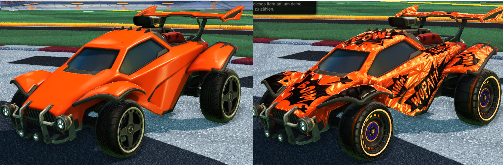
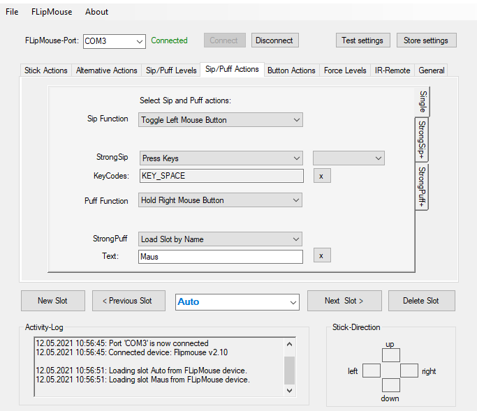

# Einstellungsanleitung für Rocket League:

1. [Rocket League](README.md#Rocket-League): kurze Spielebeschreibung
1. [Programme](README.md#Programme): alle verwendeten Programme
1. [Hardware](README.md#Hardware): verwendete Hardware
1. [FLipMouse Einstellungen](README.md#FLipMouse-Einstellungen)
1. [Rocket League Einstellungen](README.md#Rocket-League-Einstellungen)

## Rocket League

Kurz und knapp, Rocket League ist eine Mischung aus Fußball spielen und autofahren. Es wird 
ein Auto gesteuert, und mit diesem versucht man einen Ball in das gegnerische Tor zu befördern indem man 
gegen denn Ball fährt. Außerdem  gibt es auch eine möglichkeit das Auto rasant für eine kurze Zeit zu beschleunigen.
Solange das Auto beschleunigt wird, ist es möglich beim rammen eines Gegners diesen zu zerstören und 
somit für ein paar Sekunden aus dem Spiel zu nehmen.
Der Standard Spiel Modus besteht aus drei gegen drei Spielern und einer Dauer von fünf Minuten.

Das Spiel bietet jedoch noch einen zweiten Anreiz neben dem Tore jagen, nämlich das individualisieren seines Fahrzeuges. 
Am Anfang kann man zwar nurzwischen vier Fahrzeugen wählen, aber man schaltet nach dem Abschluss von Spielen sechs weitere 
Autos frei, und es gibt eine Unmenge an verschieden Lacken und Accesoires, welche erhalten werden können

Abbildung 1: Personalisierung eines Autos

## Programme

Es wird nur die FLipMouse Software und ein Steam oder Epic Games launcher benötigt um Rocket League herunterzuladen.

Die [Konfigurationsdateie](./Dateien), sowie ein [Cheatsheet](./Dateien/Rocket_League_Cheatsheet.pdf) sind verlinkt.

## Hardware

Verwendet wurden die FLipMouse und ein passendes Stativ.

## FLipMouse Einstellungen

Es gibt für dieses Spiel zwei Profile, welche in den slots der FLipMouse hinterlegt sind.

### Maus Profil
Als erstes ist ein einfaches Maus Profil eingestellt um im Menü navigieren zu können. Mit einem leichten saugen wird ein linksklick ausgeführt und mit leichtem pusten wird ein rechtsklick ausgeführt. Um auf das Fahrzeugprofil zu kommen muss stark in das Mundstück gepustet werden. 

**Stick Actions (Mundstück Bewegung)** --> MouseCursor Movement

**Sip/Puff Actions (Mundstück Aktionen)**

-   Sip Function --> Click Left Mouse Button
-   Strong Sip --> \[No Command\]
-   Puff Function --> Click Right Mouse Button
-   Strong Puff --> Load Slot by Name
	- Text --> slot2

### Fahrzeug Profil

Das zweite Profil befasst sich mit der Steuerung des Fahrzeuges. Mit dem Mundstück kann bestimmt werden in welche Richtung man sich bewegt (KEY_W nach vorne, KEY_S nach hinten, KEY_A nach links, KEY_D nach rechts). Die Mundtück Aktionen steuern den Sprung des Autos durch leichtes pusten, die Beschleunigung wird ein und ausgeschaltet durch leichtes saugen und um einen besseren Überblick zu erhalten wird die Kamera auf den Ball fokusiert mit einem starken saugen.
Wenn das Spiel dann vorbei ist kann mit starkem Pusten wieder auf das Mausprofil umgeschaltet werden.

**Stick Actions (Mundstück Bewegung)** -->Alternative Actions 

**Alternative Actions (Alternative Aktionen)**
Für die fahr Aktionen wird Hold Keys verwendet, da somit das runterdrücken der Tasturtaste simuliert wird, solange der Joystick bewegt wird. 

-   Action for Up --> Hold Keys
	- KeyCodes --> KEY_W
-   Action for Down-->
	- KeyCodes --> KEY_S
-   Action for Left-->
	- KeyCodes --> KEY_A
-   Action for Right-->
	- KeyCodes --> KEY_D

**Sip/Puff Actions (Mundstück Aktionen)**

-   Sip Function --> Toggle Left Mouse Button
-   Strong Sip --> Press Keys
	- KeyCodes --> KEY_SPACE
-   Puff Function --> Hold Right Mouse Button
-   Strong Puff --> Load Slot by Name
	- Text --> slot1

## Rocket League Einstellungen

In Rocket League müssen keine extra Einstellungen vorgenommen werden.

Abbildung 1: FLipMouse GUI im Sip/Puff Actions Reiter

**Ein Demo Video erstellen**
